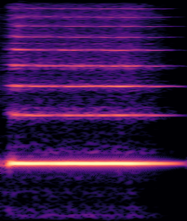
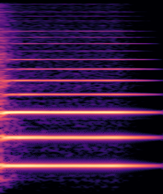

This web site demonstrates the audio examples of the paper titled **GANStrument: Adversarial Instrument Sound Synthesis with Pitch-invariant Instance Conditioning**.

**GANStrument** is a novel generative adversarial model for instrument sound synthesis.
Given a one-shot sound as input, it is able to generate pitched instrument sounds that reflect the timbre of the input within an interactive time.
By exploiting instance conditioning, GANStrument achieves better fidelity and diversity of synthesized sounds and generalization ability to various inputs.
In addition, we introduce an adversarial training scheme for a pitch-invariant feature extractor that significantly improves the pitch accuracy and timbre consistency.

* TOC
{:toc}

# Playing MIDIs
### J.S. Bach Prelude

### Bass Loop

# Conditioning Comparison
To validate the proposed approach, we trained two class-conditional GANs as strong baselines: the first model was conditioned on pitch, and the other was conditioned on both pitch and instrument category (using 11 NSynth instrument categories).
Note that we used the same architecture and training parameters for these models for fair comparison.

The following examples show the interpolation in the latent space.
For baseline models, we projected the input into the latent space by the hybrid GAN inversion that uses both an encoder and optimization as described in the original paper.
We trained both our model and baselines on the NSynth dataset [1]. The Good-sounds dataset [2] was not seen during training.
Note that NSynth inputs were taken from validation or test sets.

The following results demonstrate that the baseline models struggle with inverting the inputs and completely fail to mix two sounds.
On the other hand, GANStrument smoothly interpolates two timbres with accurate pitch.

### Keyboard and Brass (Nsynth, Fig. 2 in the original paper)
<table>
  <tr>
    <th>conditioning</th>
    <th>input 1</th>
    <th>100:0</th>
    <th>75:25</th>
    <th>50:50</th>
    <th>25:75</th>
    <th>0:100</th>
    <th>input 2</th>
  </tr>
  <tr>
    <td>pitch w/ enc.+opt.</td>
    <td> <audio controls src="https://ganstrument.github.io/ganstrument-demo/media/conditioning_comparison/nsynth_03/baseline_01/target1_audio.wav" style="width:100px;height:30px;"></audio></td>
    <td> <audio controls src="https://ganstrument.github.io/ganstrument-demo/media/conditioning_comparison/nsynth_03/baseline_01/fake_audio_ratio_0.00_pitch_39.wav" style="width:100px;height:30px;"></audio></td>
    <td> <audio controls src="https://ganstrument.github.io/ganstrument-demo/media/conditioning_comparison/nsynth_03/baseline_01/fake_audio_ratio_0.25_pitch_39.wav" style="width:100px;height:30px;"></audio></td>
    <td> <audio controls src="https://ganstrument.github.io/ganstrument-demo/media/conditioning_comparison/nsynth_03/baseline_01/fake_audio_ratio_0.50_pitch_39.wav" style="width:100px;height:30px;"></audio></td>
    <td> <audio controls src="https://ganstrument.github.io/ganstrument-demo/media/conditioning_comparison/nsynth_03/baseline_01/fake_audio_ratio_0.75_pitch_39.wav" style="width:100px;height:30px;"></audio></td>
    <td> <audio controls src="https://ganstrument.github.io/ganstrument-demo/media/conditioning_comparison/nsynth_03/baseline_01/fake_audio_ratio_1.00_pitch_39.wav" style="width:100px;height:30px;"></audio></td>
    <td> <audio controls src="https://ganstrument.github.io/ganstrument-demo/media/conditioning_comparison/nsynth_03/baseline_01/target2_audio.wav" style="width:100px;height:30px;"></audio></td>
  </tr>
  <tr>
    <td>pitch + instrument w/ enc.+opt.</td>
    <td> <audio controls src="https://ganstrument.github.io/ganstrument-demo/media/conditioning_comparison/nsynth_03/baseline_02/target1_audio.wav" style="width:100px;height:30px;"></audio></td>
    <td> <audio controls src="https://ganstrument.github.io/ganstrument-demo/media/conditioning_comparison/nsynth_03/baseline_02/fake_audio_ratio_0.00_pitch_39.wav" style="width:100px;height:30px;"></audio></td>
    <td> <audio controls src="https://ganstrument.github.io/ganstrument-demo/media/conditioning_comparison/nsynth_03/baseline_02/fake_audio_ratio_0.25_pitch_39.wav" style="width:100px;height:30px;"></audio></td>
    <td> <audio controls src="https://ganstrument.github.io/ganstrument-demo/media/conditioning_comparison/nsynth_03/baseline_02/fake_audio_ratio_0.50_pitch_39.wav" style="width:100px;height:30px;"></audio></td>
    <td> <audio controls src="https://ganstrument.github.io/ganstrument-demo/media/conditioning_comparison/nsynth_03/baseline_02/fake_audio_ratio_0.75_pitch_39.wav" style="width:100px;height:30px;"></audio></td>
    <td> <audio controls src="https://ganstrument.github.io/ganstrument-demo/media/conditioning_comparison/nsynth_03/baseline_02/fake_audio_ratio_1.00_pitch_39.wav" style="width:100px;height:30px;"></audio></td>
    <td> <audio controls src="https://ganstrument.github.io/ganstrument-demo/media/conditioning_comparison/nsynth_03/baseline_02/target2_audio.wav" style="width:100px;height:30px;"></audio></td>
  </tr>
  <tr>
    <td><b>pitch + instance (ours)</b></td>
    <td> <audio controls src="https://ganstrument.github.io/ganstrument-demo/media/conditioning_comparison/nsynth_03/ganstrument/query1_audio.wav" style="width:100px;height:30px;"></audio></td>
    <td> <audio controls src="https://ganstrument.github.io/ganstrument-demo/media/conditioning_comparison/nsynth_03/ganstrument/fake_audio_ratio_0.00_pitch_39.wav" style="width:100px;height:30px;"></audio></td>
    <td> <audio controls src="https://ganstrument.github.io/ganstrument-demo/media/conditioning_comparison/nsynth_03/ganstrument/fake_audio_ratio_0.25_pitch_39.wav" style="width:100px;height:30px;"></audio></td>
    <td> <audio controls src="https://ganstrument.github.io/ganstrument-demo/media/conditioning_comparison/nsynth_03/ganstrument/fake_audio_ratio_0.50_pitch_39.wav" style="width:100px;height:30px;"></audio></td>
    <td> <audio controls src="https://ganstrument.github.io/ganstrument-demo/media/conditioning_comparison/nsynth_03/ganstrument/fake_audio_ratio_0.75_pitch_39.wav" style="width:100px;height:30px;"></audio></td>
    <td> <audio controls src="https://ganstrument.github.io/ganstrument-demo/media/conditioning_comparison/nsynth_03/ganstrument/fake_audio_ratio_1.00_pitch_39.wav" style="width:100px;height:30px;"></audio></td>
    <td> <audio controls src="https://ganstrument.github.io/ganstrument-demo/media/conditioning_comparison/nsynth_03/ganstrument/query2_audio.wav" style="width:100px;height:30px;"></audio></td>
  </tr>
</table>

### Bass and Mallet (NSynth)
<table>
  <tr>
    <th>conditioning</th>
    <th>input 1</th>
    <th>100:0</th>
    <th>75:25</th>
    <th>50:50</th>
    <th>25:75</th>
    <th>0:100</th>
    <th>input 2</th>
  </tr>
  <tr>
    <td>pitch w/ enc.+opt.</td>
    <td> <audio controls src="https://ganstrument.github.io/ganstrument-demo/media/conditioning_comparison/nsynth_01/baseline_01/target1_audio.wav" style="width:100px;height:30px;"></audio></td>
    <td> <audio controls src="https://ganstrument.github.io/ganstrument-demo/media/conditioning_comparison/nsynth_01/baseline_01/fake_audio_ratio_0.00_pitch_39.wav" style="width:100px;height:30px;"></audio></td>
    <td> <audio controls src="https://ganstrument.github.io/ganstrument-demo/media/conditioning_comparison/nsynth_01/baseline_01/fake_audio_ratio_0.25_pitch_39.wav" style="width:100px;height:30px;"></audio></td>
    <td> <audio controls src="https://ganstrument.github.io/ganstrument-demo/media/conditioning_comparison/nsynth_01/baseline_01/fake_audio_ratio_0.50_pitch_39.wav" style="width:100px;height:30px;"></audio></td>
    <td> <audio controls src="https://ganstrument.github.io/ganstrument-demo/media/conditioning_comparison/nsynth_01/baseline_01/fake_audio_ratio_0.75_pitch_39.wav" style="width:100px;height:30px;"></audio></td>
    <td> <audio controls src="https://ganstrument.github.io/ganstrument-demo/media/conditioning_comparison/nsynth_01/baseline_01/fake_audio_ratio_1.00_pitch_39.wav" style="width:100px;height:30px;"></audio></td>
    <td> <audio controls src="https://ganstrument.github.io/ganstrument-demo/media/conditioning_comparison/nsynth_01/baseline_01/target2_audio.wav" style="width:100px;height:30px;"></audio></td>
  </tr>
  <tr>
    <td>pitch + instrument w/ enc.+opt.</td>
    <td> <audio controls src="https://ganstrument.github.io/ganstrument-demo/media/conditioning_comparison/nsynth_01/baseline_02/target1_audio.wav" style="width:100px;height:30px;"></audio></td>
    <td> <audio controls src="https://ganstrument.github.io/ganstrument-demo/media/conditioning_comparison/nsynth_01/baseline_02/fake_audio_ratio_0.00_pitch_39.wav" style="width:100px;height:30px;"></audio></td>
    <td> <audio controls src="https://ganstrument.github.io/ganstrument-demo/media/conditioning_comparison/nsynth_01/baseline_02/fake_audio_ratio_0.25_pitch_39.wav" style="width:100px;height:30px;"></audio></td>
    <td> <audio controls src="https://ganstrument.github.io/ganstrument-demo/media/conditioning_comparison/nsynth_01/baseline_02/fake_audio_ratio_0.50_pitch_39.wav" style="width:100px;height:30px;"></audio></td>
    <td> <audio controls src="https://ganstrument.github.io/ganstrument-demo/media/conditioning_comparison/nsynth_01/baseline_02/fake_audio_ratio_0.75_pitch_39.wav" style="width:100px;height:30px;"></audio></td>
    <td> <audio controls src="https://ganstrument.github.io/ganstrument-demo/media/conditioning_comparison/nsynth_01/baseline_02/fake_audio_ratio_1.00_pitch_39.wav" style="width:100px;height:30px;"></audio></td>
    <td> <audio controls src="https://ganstrument.github.io/ganstrument-demo/media/conditioning_comparison/nsynth_01/baseline_02/target2_audio.wav" style="width:100px;height:30px;"></audio></td>
  </tr>
  <tr>
    <td><b>pitch + instance (ours)</b></td>
    <td> <audio controls src="https://ganstrument.github.io/ganstrument-demo/media/conditioning_comparison/nsynth_01/ganstrument/query1_audio.wav" style="width:100px;height:30px;"></audio></td>
    <td> <audio controls src="https://ganstrument.github.io/ganstrument-demo/media/conditioning_comparison/nsynth_01/ganstrument/fake_audio_ratio_0.00_pitch_39.wav" style="width:100px;height:30px;"></audio></td>
    <td> <audio controls src="https://ganstrument.github.io/ganstrument-demo/media/conditioning_comparison/nsynth_01/ganstrument/fake_audio_ratio_0.25_pitch_39.wav" style="width:100px;height:30px;"></audio></td>
    <td> <audio controls src="https://ganstrument.github.io/ganstrument-demo/media/conditioning_comparison/nsynth_01/ganstrument/fake_audio_ratio_0.50_pitch_39.wav" style="width:100px;height:30px;"></audio></td>
    <td> <audio controls src="https://ganstrument.github.io/ganstrument-demo/media/conditioning_comparison/nsynth_01/ganstrument/fake_audio_ratio_0.75_pitch_39.wav" style="width:100px;height:30px;"></audio></td>
    <td> <audio controls src="https://ganstrument.github.io/ganstrument-demo/media/conditioning_comparison/nsynth_01/ganstrument/fake_audio_ratio_1.00_pitch_39.wav" style="width:100px;height:30px;"></audio></td>
    <td> <audio controls src="https://ganstrument.github.io/ganstrument-demo/media/conditioning_comparison/nsynth_01/ganstrument/query2_audio.wav" style="width:100px;height:30px;"></audio></td>
  </tr>
</table>

### Vocal and Guitar (NSynth)
<table>
  <tr>
    <th>conditioning</th>
    <th>input 1</th>
    <th>100:0</th>
    <th>75:25</th>
    <th>50:50</th>
    <th>25:75</th>
    <th>0:100</th>
    <th>input 2</th>
  </tr>
  <tr>
    <td>pitch w/ enc.+opt.</td>
    <td> <audio controls src="https://ganstrument.github.io/ganstrument-demo/media/conditioning_comparison/nsynth_02/baseline_01/target1_audio.wav" style="width:100px;height:30px;"></audio></td>
    <td> <audio controls src="https://ganstrument.github.io/ganstrument-demo/media/conditioning_comparison/nsynth_02/baseline_01/fake_audio_ratio_0.00_pitch_39.wav" style="width:100px;height:30px;"></audio></td>
    <td> <audio controls src="https://ganstrument.github.io/ganstrument-demo/media/conditioning_comparison/nsynth_02/baseline_01/fake_audio_ratio_0.25_pitch_39.wav" style="width:100px;height:30px;"></audio></td>
    <td> <audio controls src="https://ganstrument.github.io/ganstrument-demo/media/conditioning_comparison/nsynth_02/baseline_01/fake_audio_ratio_0.50_pitch_39.wav" style="width:100px;height:30px;"></audio></td>
    <td> <audio controls src="https://ganstrument.github.io/ganstrument-demo/media/conditioning_comparison/nsynth_02/baseline_01/fake_audio_ratio_0.75_pitch_39.wav" style="width:100px;height:30px;"></audio></td>
    <td> <audio controls src="https://ganstrument.github.io/ganstrument-demo/media/conditioning_comparison/nsynth_02/baseline_01/fake_audio_ratio_1.00_pitch_39.wav" style="width:100px;height:30px;"></audio></td>
    <td> <audio controls src="https://ganstrument.github.io/ganstrument-demo/media/conditioning_comparison/nsynth_02/baseline_01/target2_audio.wav" style="width:100px;height:30px;"></audio></td>
  </tr>
  <tr>
    <td>pitch + instrument w/ enc.+opt.</td>
    <td> <audio controls src="https://ganstrument.github.io/ganstrument-demo/media/conditioning_comparison/nsynth_02/baseline_02/target1_audio.wav" style="width:100px;height:30px;"></audio></td>
    <td> <audio controls src="https://ganstrument.github.io/ganstrument-demo/media/conditioning_comparison/nsynth_02/baseline_02/fake_audio_ratio_0.00_pitch_39.wav" style="width:100px;height:30px;"></audio></td>
    <td> <audio controls src="https://ganstrument.github.io/ganstrument-demo/media/conditioning_comparison/nsynth_02/baseline_02/fake_audio_ratio_0.25_pitch_39.wav" style="width:100px;height:30px;"></audio></td>
    <td> <audio controls src="https://ganstrument.github.io/ganstrument-demo/media/conditioning_comparison/nsynth_02/baseline_02/fake_audio_ratio_0.50_pitch_39.wav" style="width:100px;height:30px;"></audio></td>
    <td> <audio controls src="https://ganstrument.github.io/ganstrument-demo/media/conditioning_comparison/nsynth_02/baseline_02/fake_audio_ratio_0.75_pitch_39.wav" style="width:100px;height:30px;"></audio></td>
    <td> <audio controls src="https://ganstrument.github.io/ganstrument-demo/media/conditioning_comparison/nsynth_02/baseline_02/fake_audio_ratio_1.00_pitch_39.wav" style="width:100px;height:30px;"></audio></td>
    <td> <audio controls src="https://ganstrument.github.io/ganstrument-demo/media/conditioning_comparison/nsynth_02/baseline_02/target2_audio.wav" style="width:100px;height:30px;"></audio></td>
  </tr>
  <tr>
    <td><b>pitch + instance (ours)</b></td>
    <td> <audio controls src="https://ganstrument.github.io/ganstrument-demo/media/conditioning_comparison/nsynth_02/ganstrument/query1_audio.wav" style="width:100px;height:30px;"></audio></td>
    <td> <audio controls src="https://ganstrument.github.io/ganstrument-demo/media/conditioning_comparison/nsynth_02/ganstrument/fake_audio_ratio_0.00_pitch_39.wav" style="width:100px;height:30px;"></audio></td>
    <td> <audio controls src="https://ganstrument.github.io/ganstrument-demo/media/conditioning_comparison/nsynth_02/ganstrument/fake_audio_ratio_0.25_pitch_39.wav" style="width:100px;height:30px;"></audio></td>
    <td> <audio controls src="https://ganstrument.github.io/ganstrument-demo/media/conditioning_comparison/nsynth_02/ganstrument/fake_audio_ratio_0.50_pitch_39.wav" style="width:100px;height:30px;"></audio></td>
    <td> <audio controls src="https://ganstrument.github.io/ganstrument-demo/media/conditioning_comparison/nsynth_02/ganstrument/fake_audio_ratio_0.75_pitch_39.wav" style="width:100px;height:30px;"></audio></td>
    <td> <audio controls src="https://ganstrument.github.io/ganstrument-demo/media/conditioning_comparison/nsynth_02/ganstrument/fake_audio_ratio_1.00_pitch_39.wav" style="width:100px;height:30px;"></audio></td>
    <td> <audio controls src="https://ganstrument.github.io/ganstrument-demo/media/conditioning_comparison/nsynth_02/ganstrument/query2_audio.wav" style="width:100px;height:30px;"></audio></td>
  </tr>
</table>

### Clarinet and Cello (Good-sounds, *unseen*)
<table>
  <tr>
    <th>conditioning</th>
    <th>input 1</th>
    <th>100:0</th>
    <th>75:25</th>
    <th>50:50</th>
    <th>25:75</th>
    <th>0:100</th>
    <th>input 2</th>
  </tr>
  <tr>
    <td>pitch w/ enc.+opt.</td>
    <td> <audio controls src="https://ganstrument.github.io/ganstrument-demo/media/conditioning_comparison/goodsounds_01/baseline_01/target1_audio.wav" style="width:100px;height:30px;"></audio></td>
    <td> <audio controls src="https://ganstrument.github.io/ganstrument-demo/media/conditioning_comparison/goodsounds_01/baseline_01/fake_audio_ratio_0.00_pitch_39.wav" style="width:100px;height:30px;"></audio></td>
    <td> <audio controls src="https://ganstrument.github.io/ganstrument-demo/media/conditioning_comparison/goodsounds_01/baseline_01/fake_audio_ratio_0.25_pitch_39.wav" style="width:100px;height:30px;"></audio></td>
    <td> <audio controls src="https://ganstrument.github.io/ganstrument-demo/media/conditioning_comparison/goodsounds_01/baseline_01/fake_audio_ratio_0.50_pitch_39.wav" style="width:100px;height:30px;"></audio></td>
    <td> <audio controls src="https://ganstrument.github.io/ganstrument-demo/media/conditioning_comparison/goodsounds_01/baseline_01/fake_audio_ratio_0.75_pitch_39.wav" style="width:100px;height:30px;"></audio></td>
    <td> <audio controls src="https://ganstrument.github.io/ganstrument-demo/media/conditioning_comparison/goodsounds_01/baseline_01/fake_audio_ratio_1.00_pitch_39.wav" style="width:100px;height:30px;"></audio></td>
    <td> <audio controls src="https://ganstrument.github.io/ganstrument-demo/media/conditioning_comparison/goodsounds_01/baseline_01/target2_audio.wav" style="width:100px;height:30px;"></audio></td>
  </tr>
  <tr>
    <td>pitch + instrument w/ enc.+opt.</td>
    <td> <audio controls src="https://ganstrument.github.io/ganstrument-demo/media/conditioning_comparison/goodsounds_01/baseline_02/target1_audio.wav" style="width:100px;height:30px;"></audio></td>
    <td> <audio controls src="https://ganstrument.github.io/ganstrument-demo/media/conditioning_comparison/goodsounds_01/baseline_02/fake_audio_ratio_0.00_pitch_39.wav" style="width:100px;height:30px;"></audio></td>
    <td> <audio controls src="https://ganstrument.github.io/ganstrument-demo/media/conditioning_comparison/goodsounds_01/baseline_02/fake_audio_ratio_0.25_pitch_39.wav" style="width:100px;height:30px;"></audio></td>
    <td> <audio controls src="https://ganstrument.github.io/ganstrument-demo/media/conditioning_comparison/goodsounds_01/baseline_02/fake_audio_ratio_0.50_pitch_39.wav" style="width:100px;height:30px;"></audio></td>
    <td> <audio controls src="https://ganstrument.github.io/ganstrument-demo/media/conditioning_comparison/goodsounds_01/baseline_02/fake_audio_ratio_0.75_pitch_39.wav" style="width:100px;height:30px;"></audio></td>
    <td> <audio controls src="https://ganstrument.github.io/ganstrument-demo/media/conditioning_comparison/goodsounds_01/baseline_02/fake_audio_ratio_1.00_pitch_39.wav" style="width:100px;height:30px;"></audio></td>
    <td> <audio controls src="https://ganstrument.github.io/ganstrument-demo/media/conditioning_comparison/goodsounds_01/baseline_02/target2_audio.wav" style="width:100px;height:30px;"></audio></td>
  </tr>
  <tr>
    <td><b>pitch + instance (ours)</b></td>
    <td> <audio controls src="https://ganstrument.github.io/ganstrument-demo/media/conditioning_comparison/goodsounds_01/ganstrument/query1_audio.wav" style="width:100px;height:30px;"></audio></td>
    <td> <audio controls src="https://ganstrument.github.io/ganstrument-demo/media/conditioning_comparison/goodsounds_01/ganstrument/fake_audio_ratio_0.00_pitch_39.wav" style="width:100px;height:30px;"></audio></td>
    <td> <audio controls src="https://ganstrument.github.io/ganstrument-demo/media/conditioning_comparison/goodsounds_01/ganstrument/fake_audio_ratio_0.25_pitch_39.wav" style="width:100px;height:30px;"></audio></td>
    <td> <audio controls src="https://ganstrument.github.io/ganstrument-demo/media/conditioning_comparison/goodsounds_01/ganstrument/fake_audio_ratio_0.50_pitch_39.wav" style="width:100px;height:30px;"></audio></td>
    <td> <audio controls src="https://ganstrument.github.io/ganstrument-demo/media/conditioning_comparison/goodsounds_01/ganstrument/fake_audio_ratio_0.75_pitch_39.wav" style="width:100px;height:30px;"></audio></td>
    <td> <audio controls src="https://ganstrument.github.io/ganstrument-demo/media/conditioning_comparison/goodsounds_01/ganstrument/fake_audio_ratio_1.00_pitch_39.wav" style="width:100px;height:30px;"></audio></td>
    <td> <audio controls src="https://ganstrument.github.io/ganstrument-demo/media/conditioning_comparison/goodsounds_01/ganstrument/query2_audio.wav" style="width:100px;height:30px;"></audio></td>
  </tr>
</table>

### Saxophone and Trumpet (Good-sounds, *unseen*)
<table>
  <tr>
    <th>conditioning</th>
    <th>input 1</th>
    <th>100:0</th>
    <th>75:25</th>
    <th>50:50</th>
    <th>25:75</th>
    <th>0:100</th>
    <th>input 2</th>
  </tr>
  <tr>
    <td>pitch w/ enc.+opt.</td>
    <td> <audio controls src="https://ganstrument.github.io/ganstrument-demo/media/conditioning_comparison/goodsounds_02/baseline_01/target1_audio.wav" style="width:100px;height:30px;"></audio></td>
    <td> <audio controls src="https://ganstrument.github.io/ganstrument-demo/media/conditioning_comparison/goodsounds_02/baseline_01/fake_audio_ratio_0.00_pitch_39.wav" style="width:100px;height:30px;"></audio></td>
    <td> <audio controls src="https://ganstrument.github.io/ganstrument-demo/media/conditioning_comparison/goodsounds_02/baseline_01/fake_audio_ratio_0.25_pitch_39.wav" style="width:100px;height:30px;"></audio></td>
    <td> <audio controls src="https://ganstrument.github.io/ganstrument-demo/media/conditioning_comparison/goodsounds_02/baseline_01/fake_audio_ratio_0.50_pitch_39.wav" style="width:100px;height:30px;"></audio></td>
    <td> <audio controls src="https://ganstrument.github.io/ganstrument-demo/media/conditioning_comparison/goodsounds_02/baseline_01/fake_audio_ratio_0.75_pitch_39.wav" style="width:100px;height:30px;"></audio></td>
    <td> <audio controls src="https://ganstrument.github.io/ganstrument-demo/media/conditioning_comparison/goodsounds_02/baseline_01/fake_audio_ratio_1.00_pitch_39.wav" style="width:100px;height:30px;"></audio></td>
    <td> <audio controls src="https://ganstrument.github.io/ganstrument-demo/media/conditioning_comparison/goodsounds_02/baseline_01/target2_audio.wav" style="width:100px;height:30px;"></audio></td>
  </tr>
  <tr>
    <td>pitch + instrument w/ enc.+opt.</td>
    <td> <audio controls src="https://ganstrument.github.io/ganstrument-demo/media/conditioning_comparison/goodsounds_02/baseline_02/target1_audio.wav" style="width:100px;height:30px;"></audio></td>
    <td> <audio controls src="https://ganstrument.github.io/ganstrument-demo/media/conditioning_comparison/goodsounds_02/baseline_02/fake_audio_ratio_0.00_pitch_39.wav" style="width:100px;height:30px;"></audio></td>
    <td> <audio controls src="https://ganstrument.github.io/ganstrument-demo/media/conditioning_comparison/goodsounds_02/baseline_02/fake_audio_ratio_0.25_pitch_39.wav" style="width:100px;height:30px;"></audio></td>
    <td> <audio controls src="https://ganstrument.github.io/ganstrument-demo/media/conditioning_comparison/goodsounds_02/baseline_02/fake_audio_ratio_0.50_pitch_39.wav" style="width:100px;height:30px;"></audio></td>
    <td> <audio controls src="https://ganstrument.github.io/ganstrument-demo/media/conditioning_comparison/goodsounds_02/baseline_02/fake_audio_ratio_0.75_pitch_39.wav" style="width:100px;height:30px;"></audio></td>
    <td> <audio controls src="https://ganstrument.github.io/ganstrument-demo/media/conditioning_comparison/goodsounds_02/baseline_02/fake_audio_ratio_1.00_pitch_39.wav" style="width:100px;height:30px;"></audio></td>
    <td> <audio controls src="https://ganstrument.github.io/ganstrument-demo/media/conditioning_comparison/goodsounds_02/baseline_02/target2_audio.wav" style="width:100px;height:30px;"></audio></td>
  </tr>
  <tr>
    <td><b>pitch + instance (ours)</b></td>
    <td> <audio controls src="https://ganstrument.github.io/ganstrument-demo/media/conditioning_comparison/goodsounds_02/ganstrument/query1_audio.wav" style="width:100px;height:30px;"></audio></td>
    <td> <audio controls src="https://ganstrument.github.io/ganstrument-demo/media/conditioning_comparison/goodsounds_02/ganstrument/fake_audio_ratio_0.00_pitch_39.wav" style="width:100px;height:30px;"></audio></td>
    <td> <audio controls src="https://ganstrument.github.io/ganstrument-demo/media/conditioning_comparison/goodsounds_02/ganstrument/fake_audio_ratio_0.25_pitch_39.wav" style="width:100px;height:30px;"></audio></td>
    <td> <audio controls src="https://ganstrument.github.io/ganstrument-demo/media/conditioning_comparison/goodsounds_02/ganstrument/fake_audio_ratio_0.50_pitch_39.wav" style="width:100px;height:30px;"></audio></td>
    <td> <audio controls src="https://ganstrument.github.io/ganstrument-demo/media/conditioning_comparison/goodsounds_02/ganstrument/fake_audio_ratio_0.75_pitch_39.wav" style="width:100px;height:30px;"></audio></td>
    <td> <audio controls src="https://ganstrument.github.io/ganstrument-demo/media/conditioning_comparison/goodsounds_02/ganstrument/fake_audio_ratio_1.00_pitch_39.wav" style="width:100px;height:30px;"></audio></td>
    <td> <audio controls src="https://ganstrument.github.io/ganstrument-demo/media/conditioning_comparison/goodsounds_02/ganstrument/query2_audio.wav" style="width:100px;height:30px;"></audio></td>
  </tr>
</table>

### Flute and Violin (Good-sounds, *unseen*)
<table>
  <tr>
    <th>conditioning</th>
    <th>input 1</th>
    <th>100:0</th>
    <th>75:25</th>
    <th>50:50</th>
    <th>25:75</th>
    <th>0:100</th>
    <th>input 2</th>
  </tr>
  <tr>
    <td>pitch w/ enc.+opt.</td>
    <td> <audio controls src="https://ganstrument.github.io/ganstrument-demo/media/conditioning_comparison/goodsounds_03/baseline_01/target1_audio.wav" style="width:100px;height:30px;"></audio></td>
    <td> <audio controls src="https://ganstrument.github.io/ganstrument-demo/media/conditioning_comparison/goodsounds_03/baseline_01/fake_audio_ratio_0.00_pitch_51.wav" style="width:100px;height:30px;"></audio></td>
    <td> <audio controls src="https://ganstrument.github.io/ganstrument-demo/media/conditioning_comparison/goodsounds_03/baseline_01/fake_audio_ratio_0.25_pitch_51.wav" style="width:100px;height:30px;"></audio></td>
    <td> <audio controls src="https://ganstrument.github.io/ganstrument-demo/media/conditioning_comparison/goodsounds_03/baseline_01/fake_audio_ratio_0.50_pitch_51.wav" style="width:100px;height:30px;"></audio></td>
    <td> <audio controls src="https://ganstrument.github.io/ganstrument-demo/media/conditioning_comparison/goodsounds_03/baseline_01/fake_audio_ratio_0.75_pitch_51.wav" style="width:100px;height:30px;"></audio></td>
    <td> <audio controls src="https://ganstrument.github.io/ganstrument-demo/media/conditioning_comparison/goodsounds_03/baseline_01/fake_audio_ratio_1.00_pitch_51.wav" style="width:100px;height:30px;"></audio></td>
    <td> <audio controls src="https://ganstrument.github.io/ganstrument-demo/media/conditioning_comparison/goodsounds_03/baseline_01/target2_audio.wav" style="width:100px;height:30px;"></audio></td>
  </tr>
  <tr>
    <td>pitch + instrument w/ enc.+opt.</td>
    <td> <audio controls src="https://ganstrument.github.io/ganstrument-demo/media/conditioning_comparison/goodsounds_03/baseline_02/target1_audio.wav" style="width:100px;height:30px;"></audio></td>
    <td> <audio controls src="https://ganstrument.github.io/ganstrument-demo/media/conditioning_comparison/goodsounds_03/baseline_02/fake_audio_ratio_0.00_pitch_51.wav" style="width:100px;height:30px;"></audio></td>
    <td> <audio controls src="https://ganstrument.github.io/ganstrument-demo/media/conditioning_comparison/goodsounds_03/baseline_02/fake_audio_ratio_0.25_pitch_51.wav" style="width:100px;height:30px;"></audio></td>
    <td> <audio controls src="https://ganstrument.github.io/ganstrument-demo/media/conditioning_comparison/goodsounds_03/baseline_02/fake_audio_ratio_0.50_pitch_51.wav" style="width:100px;height:30px;"></audio></td>
    <td> <audio controls src="https://ganstrument.github.io/ganstrument-demo/media/conditioning_comparison/goodsounds_03/baseline_02/fake_audio_ratio_0.75_pitch_51.wav" style="width:100px;height:30px;"></audio></td>
    <td> <audio controls src="https://ganstrument.github.io/ganstrument-demo/media/conditioning_comparison/goodsounds_03/baseline_02/fake_audio_ratio_1.00_pitch_51.wav" style="width:100px;height:30px;"></audio></td>
    <td> <audio controls src="https://ganstrument.github.io/ganstrument-demo/media/conditioning_comparison/goodsounds_03/baseline_02/target2_audio.wav" style="width:100px;height:30px;"></audio></td>
  </tr>
  <tr>
    <td><b>pitch + instance (ours)</b></td>
    <td> <audio controls src="https://ganstrument.github.io/ganstrument-demo/media/conditioning_comparison/goodsounds_03/ganstrument/query1_audio.wav" style="width:100px;height:30px;"></audio></td>
    <td> <audio controls src="https://ganstrument.github.io/ganstrument-demo/media/conditioning_comparison/goodsounds_03/ganstrument/fake_audio_ratio_0.00_pitch_51.wav" style="width:100px;height:30px;"></audio></td>
    <td> <audio controls src="https://ganstrument.github.io/ganstrument-demo/media/conditioning_comparison/goodsounds_03/ganstrument/fake_audio_ratio_0.25_pitch_51.wav" style="width:100px;height:30px;"></audio></td>
    <td> <audio controls src="https://ganstrument.github.io/ganstrument-demo/media/conditioning_comparison/goodsounds_03/ganstrument/fake_audio_ratio_0.50_pitch_51.wav" style="width:100px;height:30px;"></audio></td>
    <td> <audio controls src="https://ganstrument.github.io/ganstrument-demo/media/conditioning_comparison/goodsounds_03/ganstrument/fake_audio_ratio_0.75_pitch_51.wav" style="width:100px;height:30px;"></audio></td>
    <td> <audio controls src="https://ganstrument.github.io/ganstrument-demo/media/conditioning_comparison/goodsounds_03/ganstrument/fake_audio_ratio_1.00_pitch_51.wav" style="width:100px;height:30px;"></audio></td>
    <td> <audio controls src="https://ganstrument.github.io/ganstrument-demo/media/conditioning_comparison/goodsounds_03/ganstrument/query2_audio.wav" style="width:100px;height:30px;"></audio></td>
  </tr>
</table>

# Feature Extractor Comparison
We conducted an ablation study to evaluate the effectiveness of the proposed pitch-invariant feature extractor.
For comparison, we trained an instrument identity classifier without the pitch-adversarial loss as the baseline feature extractor.

The following examples show mel-spectrograms of 88 pitches generated with the input of the NSynth and Good-sounds datasets.
Note that we fixed the noise vectors across 88 pitches.

These results demonstrate that the feature extractor without adversarial training scheme produced inaccurate pitches and timbre inconsistency.
In contrast, the pitch-invariant feature extractor with our adversarial training scheme produced stable pitches with timbre consistency.

### Keyboard (NSynth)
<table>
  <tr>
    <th>feature extractor</th>
    <th>input</th>
    <th>88 pitches</th>
  </tr>
  <tr>
    <td>w/o adv. training</td>
    <td> <audio controls src="https://ganstrument.github.io/ganstrument-demo/media/feature_extraction_comparison/nsynth_03/without_adv_training/query_audio.wav" style="width:100px;height:30px;"></audio></td>
    <td><audio controls src="https://ganstrument.github.io/ganstrument-demo/media/feature_extraction_comparison/nsynth_03/without_adv_training/fake_audio_pitch_all.wav" style="width:500px;height:30px;"></audio></td>
  </tr>
  <tr>
    <td><b>w/ adv. training</b></td>
    <td> <audio controls src="https://ganstrument.github.io/ganstrument-demo/media/feature_extraction_comparison/nsynth_03/with_adv_training/query_audio.wav" style="width:100px;height:30px;"></audio></td>
    <td> <audio controls src="https://ganstrument.github.io/ganstrument-demo/media/feature_extraction_comparison/nsynth_03/with_adv_training/fake_audio_pitch_all.wav" style="width:500px;height:30px;"></audio></td>
  </tr>
</table>

### Vocal (NSynth)
<table>
  <tr>
    <th>feature extractor</th>
    <th>input</th>
    <th>88 pitches</th>
  </tr>
  <tr>
    <td>w/o adv. training</td>
    <td> <audio controls src="https://ganstrument.github.io/ganstrument-demo/media/feature_extraction_comparison/nsynth_01/without_adv_training/query_audio.wav" style="width:100px;height:30px;"></audio></td>
    <td><audio controls src="https://ganstrument.github.io/ganstrument-demo/media/feature_extraction_comparison/nsynth_01/without_adv_training/fake_audio_pitch_all.wav" style="width:500px;height:30px;"></audio></td>
  </tr>
  <tr>
    <td><b>w/ adv. training</b></td>
    <td> <audio controls src="https://ganstrument.github.io/ganstrument-demo/media/feature_extraction_comparison/nsynth_01/with_adv_training/query_audio.wav" style="width:100px;height:30px;"></audio></td>
    <td> <audio controls src="https://ganstrument.github.io/ganstrument-demo/media/feature_extraction_comparison/nsynth_01/with_adv_training/fake_audio_pitch_all.wav" style="width:500px;height:30px;"></audio></td>
  </tr>
</table>

### Mallet (NSynth)
<table>
  <tr>
    <th>feature extractor</th>
    <th>input</th>
    <th>88 pitches</th>
  </tr>
  <tr>
    <td>w/o adv. training</td>
    <td> <audio controls src="https://ganstrument.github.io/ganstrument-demo/media/feature_extraction_comparison/nsynth_02/without_adv_training/query_audio.wav" style="width:100px;height:30px;"></audio></td>
    <td><audio controls src="https://ganstrument.github.io/ganstrument-demo/media/feature_extraction_comparison/nsynth_02/without_adv_training/fake_audio_pitch_all.wav" style="width:500px;height:30px;"></audio></td>
  </tr>
  <tr>
    <td><b>w/ adv. training</b></td>
    <td> <audio controls src="https://ganstrument.github.io/ganstrument-demo/media/feature_extraction_comparison/nsynth_02/with_adv_training/query_audio.wav" style="width:100px;height:30px;"></audio></td>
    <td> <audio controls src="https://ganstrument.github.io/ganstrument-demo/media/feature_extraction_comparison/nsynth_02/with_adv_training/fake_audio_pitch_all.wav" style="width:500px;height:30px;"></audio></td>
  </tr>
</table>

### Clarinet (Good-sounds, *unseen*)
<table>
  <tr>
    <th>feature extractor</th>
    <th>input</th>
    <th>88 pitches</th>
  </tr>
  <tr>
    <td>w/o adv. training</td>
    <td> <audio controls src="https://ganstrument.github.io/ganstrument-demo/media/feature_extraction_comparison/goodsounds_01/without_adv_training/query_audio.wav" style="width:100px;height:30px;"></audio></td>
    <td><audio controls src="https://ganstrument.github.io/ganstrument-demo/media/feature_extraction_comparison/goodsounds_01/without_adv_training/fake_audio_pitch_all.wav" style="width:500px;height:30px;"></audio></td>
  </tr>
  <tr>
    <td><b>w/ adv. training</b></td>
    <td> <audio controls src="https://ganstrument.github.io/ganstrument-demo/media/feature_extraction_comparison/goodsounds_01/with_adv_training/query_audio.wav" style="width:100px;height:30px;"></audio></td>
    <td> <audio controls src="https://ganstrument.github.io/ganstrument-demo/media/feature_extraction_comparison/goodsounds_01/with_adv_training/fake_audio_pitch_all.wav" style="width:500px;height:30px;"></audio></td>
  </tr>
</table>

### Cello (Good-sounds, *unseen*)
<table>
  <tr>
    <th>feature extractor</th>
    <th>input</th>
    <th>88 pitches</th>
  </tr>
  <tr>
    <td>w/o adv. training</td>
    <td> <audio controls src="https://ganstrument.github.io/ganstrument-demo/media/feature_extraction_comparison/goodsounds_02/without_adv_training/query_audio.wav" style="width:100px;height:30px;"></audio></td>
    <td><audio controls src="https://ganstrument.github.io/ganstrument-demo/media/feature_extraction_comparison/goodsounds_02/without_adv_training/fake_audio_pitch_all.wav" style="width:500px;height:30px;"></audio></td>
  </tr>
  <tr>
    <td><b>w/ adv. training</b></td>
    <td> <audio controls src="https://ganstrument.github.io/ganstrument-demo/media/feature_extraction_comparison/goodsounds_02/with_adv_training/query_audio.wav" style="width:100px;height:30px;"></audio></td>
    <td> <audio controls src="https://ganstrument.github.io/ganstrument-demo/media/feature_extraction_comparison/goodsounds_02/with_adv_training/fake_audio_pitch_all.wav" style="width:500px;height:30px;"></audio></td>
  </tr>
</table>

### Saxophone (Good-sounds, *unseen*, Fig. 3 in the original paper)
<table>
  <tr>
    <th>feature extractor</th>
    <th>input</th>
    <th>88 pitches</th>
  </tr>
  <tr>
    <td>w/o adv. training</td>
    <td> <audio controls src="https://ganstrument.github.io/ganstrument-demo/media/feature_extraction_comparison/goodsounds_03/without_adv_training/query_audio.wav" style="width:100px;height:30px;"></audio></td>
    <td><audio controls src="https://ganstrument.github.io/ganstrument-demo/media/feature_extraction_comparison/goodsounds_03/without_adv_training/fake_audio_pitch_all.wav" style="width:500px;height:30px;"></audio></td>
  </tr>
  <tr>
    <td><b>w/ adv. training</b></td>
    <td> <audio controls src="https://ganstrument.github.io/ganstrument-demo/media/feature_extraction_comparison/goodsounds_03/with_adv_training/query_audio.wav" style="width:100px;height:30px;"></audio></td>
    <td> <audio controls src="https://ganstrument.github.io/ganstrument-demo/media/feature_extraction_comparison/goodsounds_03/with_adv_training/fake_audio_pitch_all.wav" style="width:500px;height:30px;"></audio></td>
  </tr>
</table>

# Additional Examples
## Non-Instrument Sound Inputs
The following examples show synthesized results with the input of non-instrument sounds.
The synthesized sounds reflected the input timbres and produced stable pitch like musical instruments.

These results demonstrate that GANStrument has generalization ability to non-instrument sounds to some extent and is able to exploit a variety of sound materials to design the timbre as the traditional samplers do.

### Rooster Chicken (Fig. 4 in the original paper)
<table>
  <tr>
    <th>input</th>
    <th>pitch 48</th>
    <th>pitch 55</th>
    <th>pitch 60</th>
    <th>pitch 67</th>
    <th>pitch 72</th>
  </tr>
  <tr>
    <td> <audio controls src="https://ganstrument.github.io/ganstrument-demo/media/additional_examples/single_input/01/query_audio.wav" style="width:100px;height:30px;"></audio></td>
    <td> <audio controls src="https://ganstrument.github.io/ganstrument-demo/media/additional_examples/single_input/01/fake_audio_pitch_27.wav" style="width:100px;height:30px;"></audio></td>
    <td> <audio controls src="https://ganstrument.github.io/ganstrument-demo/media/additional_examples/single_input/01/fake_audio_pitch_34.wav" style="width:100px;height:30px;"></audio></td>
    <td> <audio controls src="https://ganstrument.github.io/ganstrument-demo/media/additional_examples/single_input/01/fake_audio_pitch_39.wav" style="width:100px;height:30px;"></audio></td>
    <td> <audio controls src="https://ganstrument.github.io/ganstrument-demo/media/additional_examples/single_input/01/fake_audio_pitch_46.wav" style="width:100px;height:30px;"></audio></td>
    <td> <audio controls src="https://ganstrument.github.io/ganstrument-demo/media/additional_examples/single_input/01/fake_audio_pitch_51.wav" style="width:100px;height:30px;"></audio></td>
  </tr>
</table>

### Water Drop (Fig. 4 in the original paper)
<table>
  <tr>
    <th>input</th>
    <th>pitch 48</th>
    <th>pitch 55</th>
    <th>pitch 60</th>
    <th>pitch 67</th>
    <th>pitch 72</th>
  </tr>
  <tr>
    <td> <audio controls src="https://ganstrument.github.io/ganstrument-demo/media/additional_examples/single_input/02/query_audio.wav" style="width:100px;height:30px;"></audio></td>
    <td> <audio controls src="https://ganstrument.github.io/ganstrument-demo/media/additional_examples/single_input/02/fake_audio_pitch_27.wav" style="width:100px;height:30px;"></audio></td>
    <td> <audio controls src="https://ganstrument.github.io/ganstrument-demo/media/additional_examples/single_input/02/fake_audio_pitch_34.wav" style="width:100px;height:30px;"></audio></td>
    <td> <audio controls src="https://ganstrument.github.io/ganstrument-demo/media/additional_examples/single_input/02/fake_audio_pitch_39.wav" style="width:100px;height:30px;"></audio></td>
    <td> <audio controls src="https://ganstrument.github.io/ganstrument-demo/media/additional_examples/single_input/02/fake_audio_pitch_46.wav" style="width:100px;height:30px;"></audio></td>
    <td> <audio controls src="https://ganstrument.github.io/ganstrument-demo/media/additional_examples/single_input/02/fake_audio_pitch_51.wav" style="width:100px;height:30px;"></audio></td>
  </tr>
</table>

### Firework Explosion
<table>
  <tr>
    <th>input</th>
    <th>pitch 36</th>
    <th>pitch 43</th>
    <th>pitch 48</th>
    <th>pitch 55</th>
    <th>pitch 60</th>
  </tr>
  <tr>
    <td> <audio controls src="https://ganstrument.github.io/ganstrument-demo/media/additional_examples/single_input/03/query_audio.wav" style="width:100px;height:30px;"></audio></td>
    <td> <audio controls src="https://ganstrument.github.io/ganstrument-demo/media/additional_examples/single_input/03/fake_audio_pitch_15.wav" style="width:100px;height:30px;"></audio></td>
    <td> <audio controls src="https://ganstrument.github.io/ganstrument-demo/media/additional_examples/single_input/03/fake_audio_pitch_22.wav" style="width:100px;height:30px;"></audio></td>
    <td> <audio controls src="https://ganstrument.github.io/ganstrument-demo/media/additional_examples/single_input/03/fake_audio_pitch_27.wav" style="width:100px;height:30px;"></audio></td>
    <td> <audio controls src="https://ganstrument.github.io/ganstrument-demo/media/additional_examples/single_input/03/fake_audio_pitch_34.wav" style="width:100px;height:30px;"></audio></td>
    <td> <audio controls src="https://ganstrument.github.io/ganstrument-demo/media/additional_examples/single_input/03/fake_audio_pitch_39.wav" style="width:100px;height:30px;"></audio></td>
  </tr>
</table>

### Cat Meow
<table>
  <tr>
    <th>input</th>
    <th>pitch 60</th>
    <th>pitch 67</th>
    <th>pitch 72</th>
    <th>pitch 79</th>
    <th>pitch 84</th>
  </tr>
  <tr>
    <td> <audio controls src="https://ganstrument.github.io/ganstrument-demo/media/additional_examples/single_input/04/query_audio.wav" style="width:100px;height:30px;"></audio></td>
    <td> <audio controls src="https://ganstrument.github.io/ganstrument-demo/media/additional_examples/single_input/04/fake_audio_pitch_39.wav" style="width:100px;height:30px;"></audio></td>
    <td> <audio controls src="https://ganstrument.github.io/ganstrument-demo/media/additional_examples/single_input/04/fake_audio_pitch_46.wav" style="width:100px;height:30px;"></audio></td>
    <td> <audio controls src="https://ganstrument.github.io/ganstrument-demo/media/additional_examples/single_input/04/fake_audio_pitch_51.wav" style="width:100px;height:30px;"></audio></td>
    <td> <audio controls src="https://ganstrument.github.io/ganstrument-demo/media/additional_examples/single_input/04/fake_audio_pitch_58.wav" style="width:100px;height:30px;"></audio></td>
    <td> <audio controls src="https://ganstrument.github.io/ganstrument-demo/media/additional_examples/single_input/04/fake_audio_pitch_63.wav" style="width:100px;height:30px;"></audio></td>
  </tr>
</table>

### Drill
<table>
  <tr>
    <th>input</th>
    <th>pitch 60</th>
    <th>pitch 67</th>
    <th>pitch 72</th>
    <th>pitch 79</th>
    <th>pitch 84</th>
  </tr>
  <tr>
    <td> <audio controls src="https://ganstrument.github.io/ganstrument-demo/media/additional_examples/single_input/05/query_audio.wav" style="width:100px;height:30px;"></audio></td>
    <td> <audio controls src="https://ganstrument.github.io/ganstrument-demo/media/additional_examples/single_input/05/fake_audio_pitch_39.wav" style="width:100px;height:30px;"></audio></td>
    <td> <audio controls src="https://ganstrument.github.io/ganstrument-demo/media/additional_examples/single_input/05/fake_audio_pitch_46.wav" style="width:100px;height:30px;"></audio></td>
    <td> <audio controls src="https://ganstrument.github.io/ganstrument-demo/media/additional_examples/single_input/05/fake_audio_pitch_51.wav" style="width:100px;height:30px;"></audio></td>
    <td> <audio controls src="https://ganstrument.github.io/ganstrument-demo/media/additional_examples/single_input/05/fake_audio_pitch_58.wav" style="width:100px;height:30px;"></audio></td>
    <td> <audio controls src="https://ganstrument.github.io/ganstrument-demo/media/additional_examples/single_input/05/fake_audio_pitch_63.wav" style="width:100px;height:30px;"></audio></td>
  </tr>
</table>

## Latent interpolation
The following examples show the interpolation in the latent space.
Their inputs included harmonic instrument sounds, percussive sounds, and non-instrument sounds as well.

These results demonstrate that GANStrument is able to smoothly interpolate multiple sounds with stable pitch and enables users to freely explore the desired timbre in the latent space.

### Organ and Guitar
<table>
  <tr>
    <th>input 1</th>
    <th>100:0</th>
    <th>75:25</th>
    <th>50:50</th>
    <th>25:75</th>
    <th>0:100</th>
    <th>input 2</th>
  </tr>
  <tr>
    <td> <audio controls src="./media/additional_examples/interpolation/03/query1_audio.wav" style="width:100px;height:30px;"></audio></td>
    <td> <audio controls src="./media/additional_examples/interpolation/03/fake_audio_ratio_0.00_pitch_60.wav" style="width:100px;height:30px;"></audio></td>
    <td> <audio controls src="./media/additional_examples/interpolation/03/fake_audio_ratio_0.25_pitch_60.wav" style="width:100px;height:30px;"></audio></td>
    <td> <audio controls src="./media/additional_examples/interpolation/03/fake_audio_ratio_0.50_pitch_60.wav" style="width:100px;height:30px;"></audio></td>
    <td> <audio controls src="./media/additional_examples/interpolation/03/fake_audio_ratio_0.75_pitch_60.wav" style="width:100px;height:30px;"></audio></td>
    <td> <audio controls src="./media/additional_examples/interpolation/03/fake_audio_ratio_1.00_pitch_60.wav" style="width:100px;height:30px;"></audio></td>
    <td> <audio controls src="./media/additional_examples/interpolation/03/query2_audio.wav" style="width:100px;height:30px;"></audio></td>
  </tr>
</table>

### Reed and Mallet
<table>
  <tr>
    <th>input 1</th>
    <th>100:0</th>
    <th>75:25</th>
    <th>50:50</th>
    <th>25:75</th>
    <th>0:100</th>
    <th>input 2</th>
  </tr>
  <tr>
    <td> <audio controls src="./media/additional_examples/interpolation/04/query1_audio.wav" style="width:100px;height:30px;"></audio></td>
    <td> <audio controls src="./media/additional_examples/interpolation/04/fake_audio_ratio_0.00_pitch_43.wav" style="width:100px;height:30px;"></audio></td>
    <td> <audio controls src="./media/additional_examples/interpolation/04/fake_audio_ratio_0.25_pitch_43.wav" style="width:100px;height:30px;"></audio></td>
    <td> <audio controls src="./media/additional_examples/interpolation/04/fake_audio_ratio_0.50_pitch_43.wav" style="width:100px;height:30px;"></audio></td>
    <td> <audio controls src="./media/additional_examples/interpolation/04/fake_audio_ratio_0.75_pitch_43.wav" style="width:100px;height:30px;"></audio></td>
    <td> <audio controls src="./media/additional_examples/interpolation/04/fake_audio_ratio_1.00_pitch_43.wav" style="width:100px;height:30px;"></audio></td>
    <td> <audio controls src="./media/additional_examples/interpolation/04/query2_audio.wav" style="width:100px;height:30px;"></audio></td>
  </tr>
</table>

### Keyboard and Flute
<table>
  <tr>
    <th>input 1</th>
    <th>100:0</th>
    <th>75:25</th>
    <th>50:50</th>
    <th>25:75</th>
    <th>0:100</th>
    <th>input 2</th>
  </tr>
  <tr>
    <td> <audio controls src="./media/additional_examples/interpolation/05/query1_audio.wav" style="width:100px;height:30px;"></audio></td>
    <td> <audio controls src="./media/additional_examples/interpolation/05/fake_audio_ratio_0.00_pitch_58.wav" style="width:100px;height:30px;"></audio></td>
    <td> <audio controls src="./media/additional_examples/interpolation/05/fake_audio_ratio_0.25_pitch_58.wav" style="width:100px;height:30px;"></audio></td>
    <td> <audio controls src="./media/additional_examples/interpolation/05/fake_audio_ratio_0.50_pitch_58.wav" style="width:100px;height:30px;"></audio></td>
    <td> <audio controls src="./media/additional_examples/interpolation/05/fake_audio_ratio_0.75_pitch_58.wav" style="width:100px;height:30px;"></audio></td>
    <td> <audio controls src="./media/additional_examples/interpolation/05/fake_audio_ratio_1.00_pitch_58.wav" style="width:100px;height:30px;"></audio></td>
    <td> <audio controls src="./media/additional_examples/interpolation/05/query2_audio.wav" style="width:100px;height:30px;"></audio></td>
  </tr>
</table>

### Brass and Organ
<table>
  <tr>
    <th>input 1</th>
    <th>100:0</th>
    <th>75:25</th>
    <th>50:50</th>
    <th>25:75</th>
    <th>0:100</th>
    <th>input 2</th>
  </tr>
  <tr>
    <td> <audio controls src="./media/additional_examples/interpolation/06/query1_audio.wav" style="width:100px;height:30px;"></audio></td>
    <td> <audio controls src="./media/additional_examples/interpolation/06/fake_audio_ratio_0.00_pitch_43.wav" style="width:100px;height:30px;"></audio></td>
    <td> <audio controls src="./media/additional_examples/interpolation/06/fake_audio_ratio_0.25_pitch_43.wav" style="width:100px;height:30px;"></audio></td>
    <td> <audio controls src="./media/additional_examples/interpolation/06/fake_audio_ratio_0.50_pitch_43.wav" style="width:100px;height:30px;"></audio></td>
    <td> <audio controls src="./media/additional_examples/interpolation/06/fake_audio_ratio_0.75_pitch_43.wav" style="width:100px;height:30px;"></audio></td>
    <td> <audio controls src="./media/additional_examples/interpolation/06/fake_audio_ratio_1.00_pitch_43.wav" style="width:100px;height:30px;"></audio></td>
    <td> <audio controls src="./media/additional_examples/interpolation/06/query2_audio.wav" style="width:100px;height:30px;"></audio></td>
  </tr>
</table>

### Reed and Hi-hat
<table>
  <tr>
    <th>input 1</th>
    <th>100:0</th>
    <th>75:25</th>
    <th>50:50</th>
    <th>25:75</th>
    <th>0:100</th>
    <th>input 2</th>
  </tr>
  <tr>
    <td> <audio controls src="./media/additional_examples/interpolation/01/query1_audio.wav" style="width:100px;height:30px;"></audio></td>
    <td> <audio controls src="./media/additional_examples/interpolation/01/fake_audio_ratio_0.00_pitch_48.wav" style="width:100px;height:30px;"></audio></td>
    <td> <audio controls src="./media/additional_examples/interpolation/01/fake_audio_ratio_0.25_pitch_48.wav" style="width:100px;height:30px;"></audio></td>
    <td> <audio controls src="./media/additional_examples/interpolation/01/fake_audio_ratio_0.50_pitch_48.wav" style="width:100px;height:30px;"></audio></td>
    <td> <audio controls src="./media/additional_examples/interpolation/01/fake_audio_ratio_0.75_pitch_48.wav" style="width:100px;height:30px;"></audio></td>
    <td> <audio controls src="./media/additional_examples/interpolation/01/fake_audio_ratio_1.00_pitch_48.wav" style="width:100px;height:30px;"></audio></td>
    <td> <audio controls src="./media/additional_examples/interpolation/01/query2_audio.wav" style="width:100px;height:30px;"></audio></td>
  </tr>
</table>

### Bass and Tom
<table>
  <tr>
    <th>input 1</th>
    <th>100:0</th>
    <th>75:25</th>
    <th>50:50</th>
    <th>25:75</th>
    <th>0:100</th>
    <th>input 2</th>
  </tr>
  <tr>
    <td> <audio controls src="./media/additional_examples/interpolation/02/query1_audio.wav" style="width:100px;height:30px;"></audio></td>
    <td> <audio controls src="./media/additional_examples/interpolation/02/fake_audio_ratio_0.00_pitch_15.wav" style="width:100px;height:30px;"></audio></td>
    <td> <audio controls src="./media/additional_examples/interpolation/02/fake_audio_ratio_0.25_pitch_15.wav" style="width:100px;height:30px;"></audio></td>
    <td> <audio controls src="./media/additional_examples/interpolation/02/fake_audio_ratio_0.50_pitch_15.wav" style="width:100px;height:30px;"></audio></td>
    <td> <audio controls src="./media/additional_examples/interpolation/02/fake_audio_ratio_0.75_pitch_15.wav" style="width:100px;height:30px;"></audio></td>
    <td> <audio controls src="./media/additional_examples/interpolation/02/fake_audio_ratio_1.00_pitch_15.wav" style="width:100px;height:30px;"></audio></td>
    <td> <audio controls src="./media/additional_examples/interpolation/02/query2_audio.wav" style="width:100px;height:30px;"></audio></td>
  </tr>
</table>

### Guitar and Cat Meow
<table>
  <tr>
    <th>input 1</th>
    <th>100:0</th>
    <th>75:25</th>
    <th>50:50</th>
    <th>25:75</th>
    <th>0:100</th>
    <th>input 2</th>
  </tr>
  <tr>
    <td> <audio controls src="./media/additional_examples/interpolation/07/query1_audio.wav" style="width:100px;height:30px;"></audio></td>
    <td> <audio controls src="./media/additional_examples/interpolation/07/fake_audio_ratio_0.00_pitch_63.wav" style="width:100px;height:30px;"></audio></td>
    <td> <audio controls src="./media/additional_examples/interpolation/07/fake_audio_ratio_0.25_pitch_63.wav" style="width:100px;height:30px;"></audio></td>
    <td> <audio controls src="./media/additional_examples/interpolation/07/fake_audio_ratio_0.50_pitch_63.wav" style="width:100px;height:30px;"></audio></td>
    <td> <audio controls src="./media/additional_examples/interpolation/07/fake_audio_ratio_0.75_pitch_63.wav" style="width:100px;height:30px;"></audio></td>
    <td> <audio controls src="./media/additional_examples/interpolation/07/fake_audio_ratio_1.00_pitch_63.wav" style="width:100px;height:30px;"></audio></td>
    <td> <audio controls src="./media/additional_examples/interpolation/07/query2_audio.wav" style="width:100px;height:30px;"></audio></td>
  </tr>
</table>

### Reed and Drill
<table>
  <tr>
    <th>input 1</th>
    <th>100:0</th>
    <th>75:25</th>
    <th>50:50</th>
    <th>25:75</th>
    <th>0:100</th>
    <th>input 2</th>
  </tr>
  <tr>
    <td> <audio controls src="./media/additional_examples/interpolation/08/query1_audio.wav" style="width:100px;height:30px;"></audio></td>
    <td> <audio controls src="./media/additional_examples/interpolation/08/fake_audio_ratio_0.00_pitch_48.wav" style="width:100px;height:30px;"></audio></td>
    <td> <audio controls src="./media/additional_examples/interpolation/08/fake_audio_ratio_0.25_pitch_48.wav" style="width:100px;height:30px;"></audio></td>
    <td> <audio controls src="./media/additional_examples/interpolation/08/fake_audio_ratio_0.50_pitch_48.wav" style="width:100px;height:30px;"></audio></td>
    <td> <audio controls src="./media/additional_examples/interpolation/08/fake_audio_ratio_0.75_pitch_48.wav" style="width:100px;height:30px;"></audio></td>
    <td> <audio controls src="./media/additional_examples/interpolation/08/fake_audio_ratio_1.00_pitch_48.wav" style="width:100px;height:30px;"></audio></td>
    <td> <audio controls src="./media/additional_examples/interpolation/08/query2_audio.wav" style="width:100px;height:30px;"></audio></td>
  </tr>
</table>

# References
[1] J. Engel, C. Resnick, A. Roberts, S. Dieleman,
M. Norouzi, D. Eck, and K. Simonyan, Neural audio
synthesis of musical notes with wavenet autoencoders,
in Proc. ICML, 2017.

[2] O. Romani Picas, H. Parra Rodriguez, D. Dabiri,
H. Tokuda, W. Hariya, K. Oishi, and X. Serra, A
real-time system for measuring sound goodness in instrumental
sounds, in Audio Engineering Society Convention
138, 2015.
